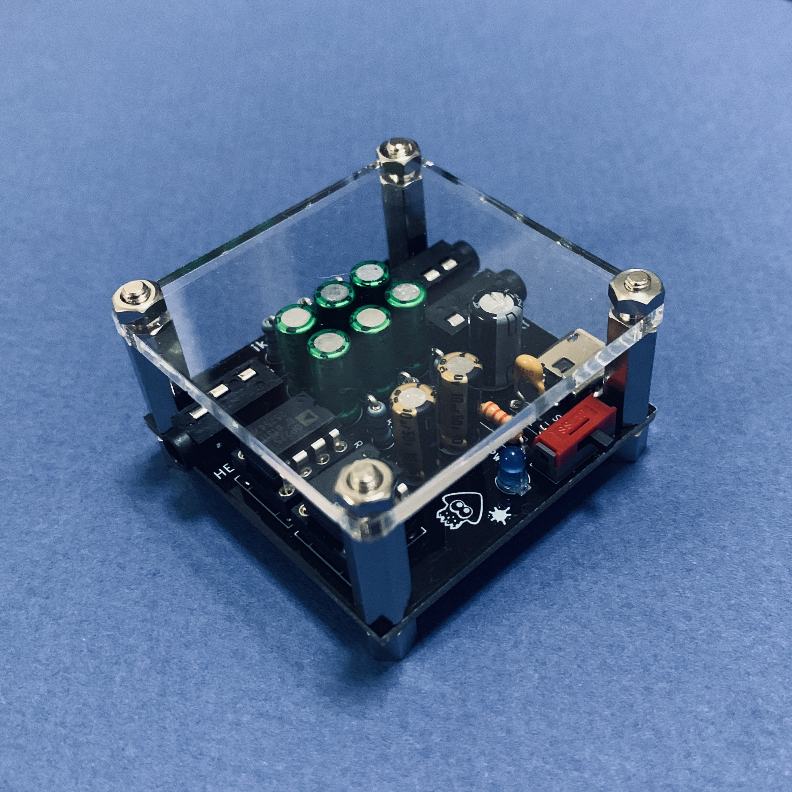
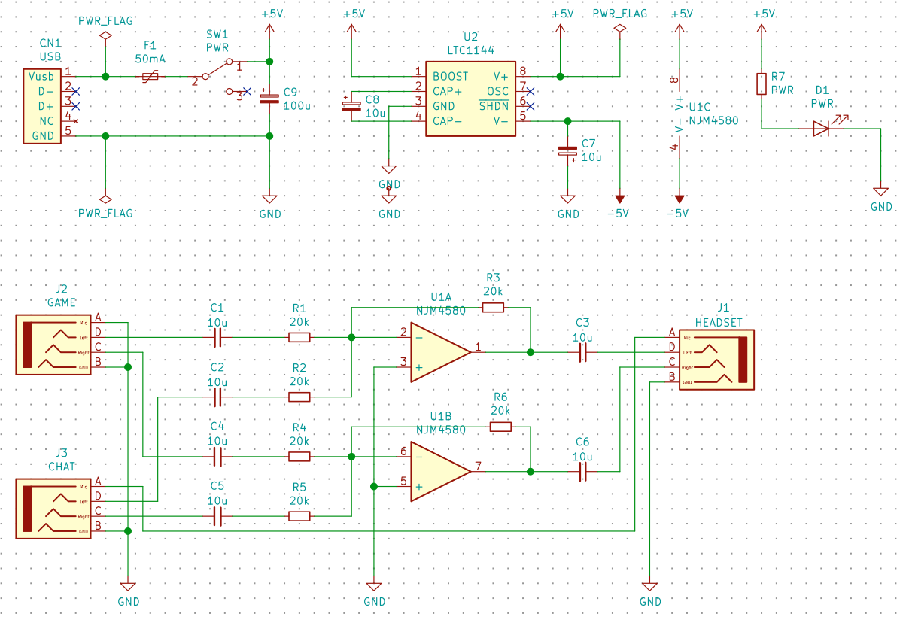
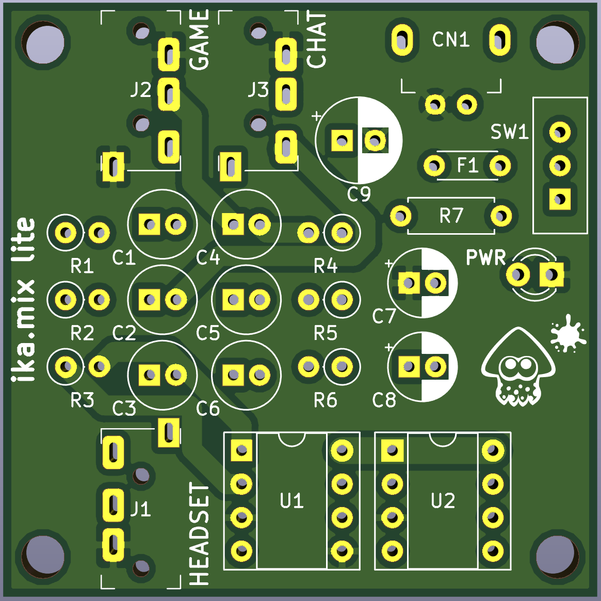

# ika.mix lite

ゲーム機とスマホ(orパソコン)とヘッドセットを接続する通話用ミキサー。

## ガーバーデータ

[ika-mix-lite.zip](./ika-mix-lite.zip)

## 回路図

## 基板レイアウト

## 部品表

### ミキサー部分

| 番号 | パーツ名 | 通販コード | 個数 | 単価 |
|---|---|---|--:|--:|
|R1-R6 | 金属皮膜抵抗 1/4W20kΩ | [R-03406](http://akizukidenshi.com/catalog/g/gR-03406/) | 6 | 300円(100本入) |
|C1-C6 | オーディオ用無極性電解コンデンサー 10μF | [P-04638](http://akizukidenshi.com/catalog/g/gP-04638/) | 6 | 20円 |
|J1-J3 | 3.5mm4極ミニジャック 基板取付用 | [C-06070](http://akizukidenshi.com/catalog/g/gC-06070/) | 3 | 50円 | 
|U1    | 2回路入HiFiオペアンプ　ローノイズ選別品 NJM4580DD | [I-00069](http://akizukidenshi.com/catalog/g/gI-00069/) | 1 | 25円 |

### 電源部分

| 番号 | パーツ名 | 通販コード | 個数 | 単価 |
|---|---|---|--:|--:|
|CN1   | 基板用マイクロUSBコネクタ(電源専用) | [C-10398](http://akizukidenshi.com/catalog/g/gC-10398/) | 1 | 30円 |
|F1    | ポリスイッチ100mA (200mAで遮断)  | [P-01353](http://akizukidenshi.com/catalog/g/gP-01353/) | 1 | 30円 |
|SW1   | 2.54mmピッチ端子形スライドスイッチ【SS12SDH2】| なし (*1) | 1 | 60円 |    
|C7-C8 | オーディオ用電解コンデンサー 10μF | [P-04621](http://akizukidenshi.com/catalog/g/gP-04621/) | 2 | 10円 |
|C9    | 電源用電解コンデンサー  100μF | [P-02724](http://akizukidenshi.com/catalog/g/gP-02724/) | 1 | 15円 |
|U2    | 電圧コンバータ LTC1144 | [I-01628](http://akizukidenshi.com/catalog/g/gI-01628/) | 1 | 400円 |

*1: 秋月取扱い品なら [P-12723](http://akizukidenshi.com/catalog/g/gP-12723/) この辺りが使えるかも知れないけど不格好になる。

### 電源LED

適当に好きな色、明るさで調節。

| 番号 | パーツ名 | 通販コード | 個数 | 単価 |
|---|---|---|--:|--:|
|D1    | 3mm 青色 LED | [I-11578](http://akizukidenshi.com/catalog/g/gI-11578/) | 1 | 20円 |    
|R7    | カーボン抵抗 1/2W2.2kΩ | [R-07825](http://akizukidenshi.com/catalog/g/gR-07825/) | 1 | 100円(100本入) | 

### その他

ICソケットと外装用の部品。秋月取扱いのアクリルパネルは基板サイズより少し大きいので不格好かも知れない。

| 番号 | パーツ名 | 通販コード | 個数 | 単価 |
|---|---|---|--:|--:|
|U1-U2 | 丸ピンICソケット (8P) | [P-00035](http://akizukidenshi.com/catalog/g/gP-00035/) | 2 | 15円 |　
|- | 六角オネジ・メネジ MB3-5 | [P-07471](http://akizukidenshi.com/catalog/g/gP-07471/) | 4 | 30円 |
|- | 六角オネジ・メネジ MB3-15 | [P-07320](http://akizukidenshi.com/catalog/g/gP-07320/) | 4 | 30円 |
|-| 六角ナット　M3x0.5 | [P-11521](http://akizukidenshi.com/catalog/g/gP-11521/) | 4 | 500円(100個入) |
|-| 45基板用アクリルパネル (アクリル板) | [P-12443](http://akizukidenshi.com/catalog/g/gP-12443/) | 1 | 105円 |
